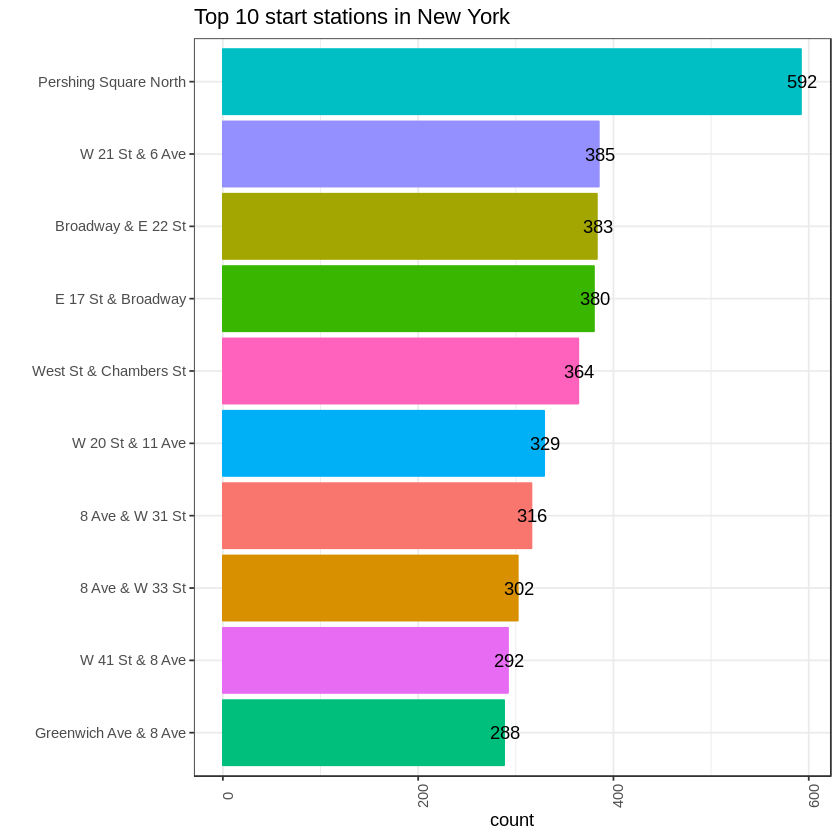
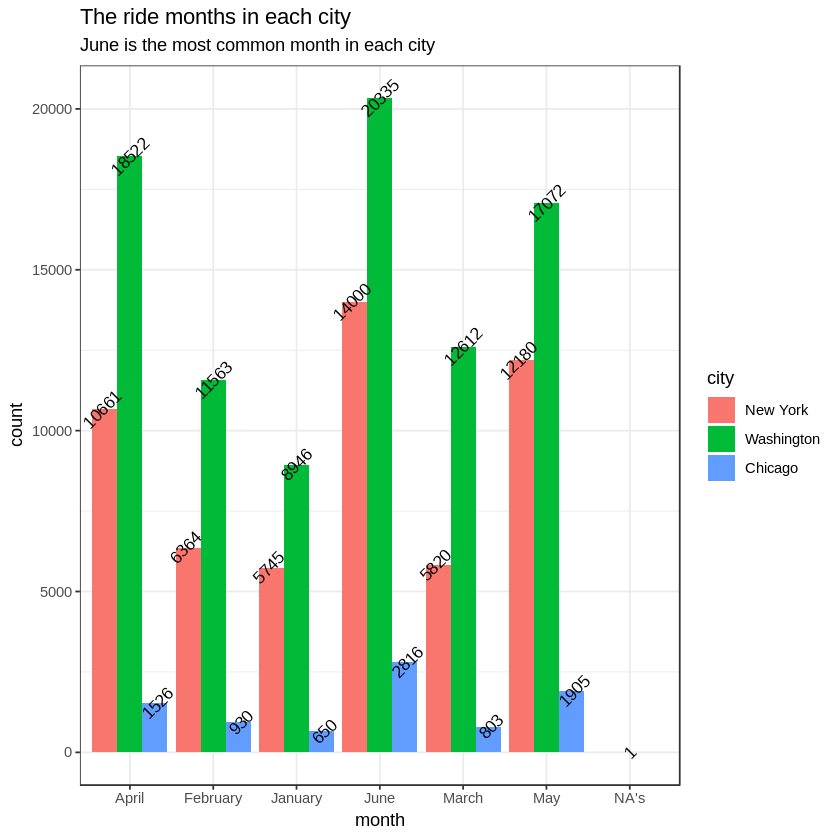

# Explore bikeshare data

A course project in the R programming for data science nanodegree. For this project, the goal is to ask and answer three questions about the available bikeshare data from Washington, Chicago, and New York.

Bicycle-sharing systems allow users to rent bicycles on a very short-term basis for a price. This allows people to borrow a bike from point A and return it at point B, though they can also return it to the same location if they'd like to just go for a ride. Regardless, each bike can serve several users per day.

## Installation

This project requires a conda environment that has R installed.

```bash

git clone https://github.com/maqui7295/explore-bikeshare-data

cd explore-bikeshare-data

jupyter notebook

```

## Excerpts from the Project

### Inspect the Data

```R
head(ny)
nrow(ny)
```

<table>
<thead><tr><th scope=col>X</th><th scope=col>Start.Time</th><th scope=col>End.Time</th><th scope=col>Trip.Duration</th><th scope=col>Start.Station</th><th scope=col>End.Station</th><th scope=col>User.Type</th><th scope=col>Gender</th><th scope=col>Birth.Year</th></tr></thead>
<tbody>
 <tr><td>5688089                                       </td><td>2017-06-11 14:55:05                           </td><td>2017-06-11 15:08:21                           </td><td> 795                                          </td><td>Suffolk St &amp; Stanton St                   </td><td>W Broadway &amp; Spring St                    </td><td>Subscriber                                    </td><td><span style=white-space:pre-wrap>Male  </span></td><td>1998                                          </td></tr>
 <tr><td>4096714                                                           </td><td>2017-05-11 15:30:11                                               </td><td>2017-05-11 15:41:43                                               </td><td> 692                                                              </td><td>Lexington Ave &amp; E 63 St                                       </td><td><span style=white-space:pre-wrap>1 Ave &amp; E 78 St       </span></td><td>Subscriber                                                        </td><td><span style=white-space:pre-wrap>Male  </span>                    </td><td>1981                                                              </td></tr>
 <tr><td>2173887                                                            </td><td>2017-03-29 13:26:26                                                </td><td>2017-03-29 13:48:31                                                </td><td>1325                                                               </td><td><span style=white-space:pre-wrap>1 Pl &amp; Clinton St      </span></td><td><span style=white-space:pre-wrap>Henry St &amp; Degraw St  </span> </td><td>Subscriber                                                         </td><td><span style=white-space:pre-wrap>Male  </span>                     </td><td>1987                                                               </td></tr>
 <tr><td>3945638                                                            </td><td>2017-05-08 19:47:18                                                </td><td>2017-05-08 19:59:01                                                </td><td> 703                                                               </td><td><span style=white-space:pre-wrap>Barrow St &amp; Hudson St  </span></td><td><span style=white-space:pre-wrap>W 20 St &amp; 8 Ave       </span> </td><td>Subscriber                                                         </td><td>Female                                                             </td><td>1986                                                               </td></tr>
 <tr><td>6208972                                                            </td><td>2017-06-21 07:49:16                                                </td><td>2017-06-21 07:54:46                                                </td><td> 329                                                               </td><td><span style=white-space:pre-wrap>1 Ave &amp; E 44 St        </span></td><td><span style=white-space:pre-wrap>E 53 St &amp; 3 Ave       </span> </td><td>Subscriber                                                         </td><td><span style=white-space:pre-wrap>Male  </span>                     </td><td>1992                                                               </td></tr>
 <tr><td>1285652                                                            </td><td>2017-02-22 18:55:24                                                </td><td>2017-02-22 19:12:03                                                </td><td> 998                                                               </td><td><span style=white-space:pre-wrap>State St &amp; Smith St    </span></td><td><span style=white-space:pre-wrap>Bond St &amp; Fulton St   </span> </td><td>Subscriber                                                         </td><td><span style=white-space:pre-wrap>Male  </span>                     </td><td>1986                                                               </td></tr>
</tbody>
</table>

54770


## Question 1

**What is the most common start station in each city?**

```R
# helper function
getMostCommonSS <- function(x) {
    # The summary function when applied to a factor variable gives the count (in descending order) 
    #  of each category (level) in the factor
    ss <- summary(as.factor(x))
    return(ss)
}

printMostCommon <- function(ss, city) {
    res  <- paste("Most common start station in", city, "is", names(head(ss, 1)), "with", head(ss, 1), "rides.")
    return(res)
}

# Get the most common start station in each city
NY.SS <- getMostCommonSS(ny$Start.Station)
wash.SS <- getMostCommonSS(wash$Start.Station)
chi.SS <- getMostCommonSS(chi$Start.Station)

printMostCommon(NY.SS, "New York")
printMostCommon(wash.SS, "Washington")
printMostCommon(chi.SS, "Chicago")
```

'Most common start station in New York is Pershing Square North with 592 rides.'

'Most common start station in Washington is Columbus Circle / Union Station with 1700 rides.'

'Most common start station in Chicago is Streeter Dr &amp; Grand Ave with 210 rides.'

```R
library(ggplot2)

# a helper function that plots the top N start stations in each city
# SS is a named vector that holds the count of each start stations
plotTopN <- function(SS, city, n) {
  
  # convert the named integers to a dataframe
  df <- data.frame(station=names(SS), SS)
  
  # remove the rownames generated by the data.frame function
  rownames(df) <- NULL
  
  ggplot(df[1:n, ], 
         aes(x=reorder(station, SS), y=SS, label=SS, fill=station, color=station)) + 
    geom_col() +
    # push the data labels to the top of the bars and make them black
    geom_text(nudge_y = 1, color="black") +
    labs(title = paste("Top", n, "start stations in", city), 
         x="", y="count") + theme_bw() +
    # rotate the axis text by 90 degrees; also make the plot horizontal
    theme(axis.text.x = element_text(angle = 90), legend.position = "none") + 
    coord_flip()
  
}

```

```R
# print the top start stations in New York city
plotTopN(NY.SS, "New York", 10)
```




## Question 2

**What is the most common ride month in each city?**

```R
# A function that separate the Start.Time column of a dataframe.
# The generated column includes start_date, start_month_name (e.g. June), start_month (e.g. 06), start_day and start_year 
addStartMonth <- function(df) {
  
    #convert to date (format: YYYY-MM-DD)
    df$start_date <- as.Date(df$Start.Time)

    # get the full name of the month e.g July
    df$start_month_name <- months(df$start_date, FALSE)

    # replace the year and month part of the date with an empty string
    df$start_day <- sub("\\d{4}-\\d{2}-", "", df$start_date)
    
    # remove the month and day part
    df$start_year <- sub("-\\d{2}-.*", "", df$start_date)
    
    # remove the year and day parts
    df$start_month <- sub("-\\d{2}", "", sub("\\d{4}-", "", df$start_date))
  
  return(df)
}


ny2 <- addStartMonth(ny)
wash2 <- addStartMonth(wash)
chi2 <- addStartMonth(chi)

levels <- c("January", "February", "March", "April", "May", "June")

# get the counts of the ride months in each city
NY.month_counts <- summary(factor(ny2$start_month_name, levels=levels))
wash.month_counts <- summary(factor(wash2$start_month_name, levels=levels))
chi.month_counts <- summary(factor(chi2$start_month_name, levels=levels))

# display the results
# NY.month_counts
# wash.month_counts  # the NA does not matter in this case
# chi.month_counts
```

```R
# Creating a plot to compare the months side by side

# convert the counts to a dataframe
df_ny_mnth <- data.frame(month=names(NY.month_counts), count=NY.month_counts, city="New York")
df_wash_mnth <- data.frame(month=names(wash.month_counts), count=wash.month_counts, city="Washington")
df_chi_mnth <- data.frame(month=names(chi.month_counts), count=chi.month_counts, city="Chicago")

# combine all to a single dataset
df_all_mnth <- rbind(df_ny_mnth, df_wash_mnth, df_chi_mnth)

# remove the rownames of the dataset
rownames(df_all_mnth) <- NULL

# create the plot
ggplot(df_all_mnth, aes(x=month, y=count, fill=city, label=count)) + 
  # put the bars side by side
  geom_col(position = position_dodge()) +
  # tilt the data labels to angle of 45 degrees to avoid overlapping
  geom_text(position = position_dodge(width = 1), size=3.5, angle=45) + 
  theme_bw() +
  ggtitle("The ride months in each city", 
          subtitle = "June is the most common month in each city")
```



**In each city, most of the bike rides occurred in June.**
